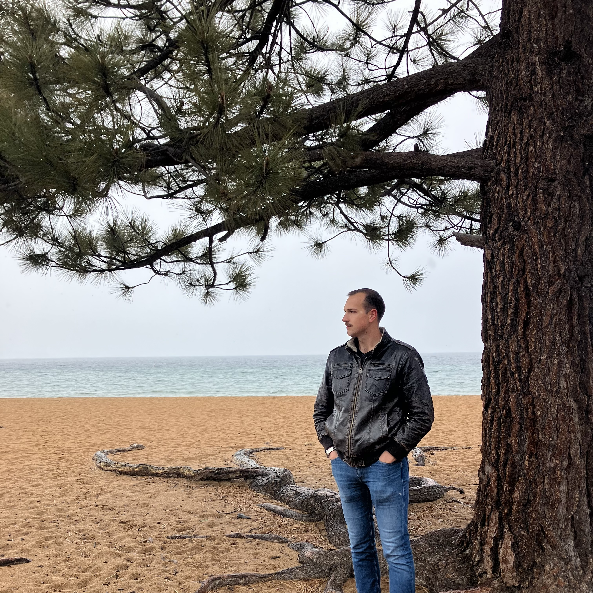

<a href="/" style="color: black">**Home**</a> <a style="color: green"> ▪ </a> <a href="/about" style="color: green">**About**</a> <a style="color: green"> ▪ </a> <a href="/works" style="color: black">**Works**</a> <a style="color: green"> ▪ </a> <a href="/listen" style="color: black">**Listen**</a> <a style="color: green"> ▪ </a> <a href="/writings" style="color: black">**Writings**</a>

***

&nbsp; &nbsp; <a style="color: green">MATTHEW MONACO</a> (b. 1997 in Teaneck, New Jersey) was immersed in jazz music from an early age, beginning his musical training improvising at the piano. Further studies in jazz were interrupted by his simultaneous encounter with the works of J.S. Bach and Stravinsky, leading to an instant fascination with notated classical music. Committed to maintaining jazz and classical as essential aspects of his musical identity, Matthew began his training and career as a composer of acoustic and electroacoustic music at the New England Conservatory in Boston, in the class of Stratis Minakakis. From 2018 to 2020, Matthew organized a monthly concert series for contemporary music, programming premieres by NEC composers, often performing his own music and that of his peers.
  

&nbsp; &nbsp; After obtaining his Bachelor's degree in 2020, Matthew moved to Paris, studying with Stefano Gervasoni for two years at the Conservatoire National Supérieur de Musique et de Danse de Paris (CNSMDP), earning his Master’s in 2022. While at the Paris Conservatory, Matthew deepened his knowledge of electronic music through courses with Yan Maresz, Luis Naon, and Grégoire Lorieux. These years of study led to collaborations with groups including Ensemble intercontemporain, Ensemble Itinéraire, Ensemble Court-circuit, Ensemble Linea, the Callithumpian Consort, the Del Sol Quartet, the Brouwer Trio, Orchestre des lauréats du Conservatoire (CNSMDP), and conductors such as Hugh Wolff, Jean Deroyer, Jean-Philippe Wurtz, Stephen Drury, David Loebel, and Léo Margue.
  

&nbsp; &nbsp; Matthew continued his studies with another change of scene, entering the doctorate program in composition (PhD) at the University of California, Berkeley in 2022. In particular, he studied piano with Myra Melford, with whom he expanded and refined his improvisational skills, following in the heritage of American free jazz, a source from which much of his musical language draws inspiration.
  

&nbsp; &nbsp; While Matthew's music explores a complex terrain in between the worlds of notation, improvisation, and game pieces, his research focuses on intersections of phenomenology and music theory, creating a space for work-specific methods in contemporary music analysis. Two current (separate) research projects focus on musico-grammatical paradigms in the solo performances of Cecil Taylor and rhythmic processes in Beat Furrer's <em>Konzert</em>. 
  

&nbsp; &nbsp; He recently worked with Ensemble Linea to premiere <em>Thread</em> (commissioned by the Royaumont Foundation) at the Festival aux Chandelles.

  
  

&nbsp; &nbsp; 2026 will see the premieres of new works in Cyprus (Nicosia), Italy (Milan), Slovenia (Bled), and Poland (Rybna).

&nbsp; &nbsp; Through his travels and his desire to meet the composers who inspire him, Matthew has frequently participated in international academies (ManiFeste, Voix Nouvelles, VIPA etc.), and benefited from the advice (and ears) of Kaija Saariaho, Tristan Murail, Toshio Hosokawa, Philippe Leroux, Philippe Manoury, Diana Soh, Francesco Filidei, Francesca Verunelli, and Du Yun, among others.
  

&nbsp; &nbsp; Matthew lives in Paris as a recipient of the George Ladd Prix de Paris.
  
 
<a href="/bio-en-francais" style="color: green"><strong>Bio en français</strong></a>   

***

<a style="color: green"><strong>EDUCATION</strong></a>

 

<strong>PhD Candidate in Composition</strong> (ABD: graduation May 2027)

&nbsp; &nbsp; <em>University of California, Berkeley</em>

 

<strong>Master's Degree in Composition</strong> (2022)

&nbsp; &nbsp; <em>Conservatoire National Supérieur de Musique et de Danse de Paris</em>

 

<strong>Bachelor's Degree in Composition</strong> (2020)

&nbsp; &nbsp; <em>New England Conservatory</em>, Minor in Music Theory

***

<a style="color: green"><strong>SELECTED AWARDS AND ACHIEVEMENTS</strong></a>

 

<strong>2025</strong> George Ladd Prix de Paris (Berkeley, USA)     

<strong>2025</strong> Roselyn Schneider Eisner Prize in Music (Berkeley, USA)     

<strong>2024</strong> Invited Composer, ManiFeste 2024 (Paris, France)   

<strong>2023</strong> Composition Fellow, Workshop with Ensemble l'Itinéraire (Berkeley, USA)   

<strong>2023</strong> Invited Composer, Académie Voix Nouvelles (Asnières-sur-Oise, France)   

<strong>2021</strong> (November) Composition Workshop with Ensemble intercontemporain (Paris, France)   

<strong>2021</strong> (January) Composition Workshop with Ensemble intercontemporain (Paris, France)   

<strong>2019-2020</strong> Alinéa Composer-in-Residence (Boston, USA)   

<strong>2019</strong> Callithumpian Consort Call for Scores Winner (Boston, USA)   

<strong>2019</strong> Composition Fellow, Etchings Festival (Auvillar, France)   

<strong>2019</strong> Composition Fellow, VIPA Festival (Valencia, Spain)   

<strong>2018</strong> NEC Honors Ensemble Winner (Boston, USA)   

<strong>2017</strong> Boston Philharmonic Youth Orchestra Young Composers Institute Winner (Boston, USA)   

***

<a style="color: green"><strong>WORK EXPERIENCE</strong></a>

 

<strong>Aug. 2023 — Present</strong> Graduate Student Instructor at UC Berkeley (Berkeley, USA)  

<strong>Sep. 2018 — May 2020</strong> Tuesday Night New Music Concert Series Curator (Boston, USA)     

<strong>Jan. 2018 — May 2020</strong> NEC Music Theory TA/Tutor (Boston, USA)     

<strong>Sep. 2018 — Mar. 2020</strong> New England Conservatory Preparatory School Substitute Instructor (Boston, USA)     

<strong>Apr. 2018 — May 2018</strong> NEC School of Continuing Education Substitute Instructor (Boston, USA)     

<strong>Apr. 2017 — Present</strong> Music Engraving (Freelance)  

<strong>Sep. 2015 — May 2016</strong> New York Philharmonic Education Department Intern (New York, USA) 

***

***

<a href="/" style="color: black">**Home**</a> <a style="color: green"> ▪ </a> <a href="/about" style="color: green">**About**</a> <a style="color: green"> ▪ </a> <a href="/works" style="color: black">**Works**</a> <a style="color: green"> ▪ </a> <a href="/listen" style="color: black">**Listen**</a> <a style="color: green"> ▪ </a> <a href="/writings" style="color: black">**Writings**</a>

***

        

***

<a style="color: grey"> Official website of composer Matthew Monaco </a>
  

