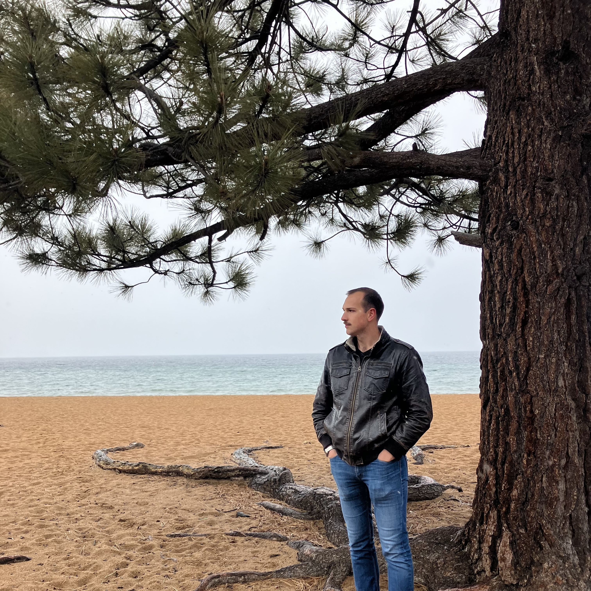

&nbsp; &nbsp; <a style="color: green">MATTHEW MONACO</a> (b. 1997 in Teaneck, New Jersey) was immersed in jazz music from an early age, beginning his musical training improvising at the piano. Further studies in jazz were interrupted by his simultaneous encounter with the works of J.S. Bach and Stravinsky, leading to an instant fascination with notated classical music. Committed to maintaining jazz and classical as essential aspects of his musical identity, Monaco began his training and career as a composer of acoustic and electroacoustic music at the New England Conservatory in Boston, in the class of Stratis Minakakis. From 2018 to 2020, Monaco organized a monthly concert series for contemporary music, programming premieres by NEC composers, often performing his own music and that of his peers.
  

&nbsp; &nbsp; After obtaining his Bachelor's degree in 2020, Monaco moved to Paris, studying with Stefano Gervasoni for two years at the Conservatoire National Supérieur de Musique et de Danse de Paris (CNSMDP), earning his Master’s in 2022. While at the Paris Conservatory, Monaco deepened his knowledge of electronic music through courses with Yan Maresz, Luis Naon, and Grégoire Lorieux. These years of study led to collaborations with groups including Ensemble intercontemporain, Ensemble Itinéraire, Ensemble Court-circuit, Ensemble Linea, the Callithumpian Consort, the Del Sol Quartet, the Brouwer Trio, Patsiaoura Ensemble, Orchestre des lauréats du Conservatoire (CNSMDP), and conductors such as Hugh Wolff, Jean Deroyer, Jean-Philippe Wurtz, Stephen Drury, David Loebel, and Léo Margue.
  

&nbsp; &nbsp; In order to satiate his growing interest in electroacoustic music, Monaco entered the doctorate program in composition (PhD) at the University of California, Berkeley in 2022, working under Carmine-Emanuele Cella and Edmund Campion at the Center for New Music and Audio Technologies (CNMAT). In addition, he studied piano and composition with Myra Melford, with whom he expanded and refined his improvisational skills, following in the heritage of American free jazz, a source from which much of his musical language draws inspiration.
  

&nbsp; &nbsp; While Monaco's music explores a complex terrain in between the worlds of notation, improvisation, and game pieces, his research focuses on intersections of phenomenology and music theory, creating a space for work-specific methods in contemporary music analysis. Two current (separate) research projects focus on musico-grammatical paradigms in the solo performances of Cecil Taylor and rhythmic processes in Beat Furrer's <em>Konzert</em>. 
  

&nbsp; &nbsp; He recently worked with Ensemble Linea to premiere <em>Thread</em> (commissioned by the Royaumont Foundation) at the Festival aux Chandelles. 2026 will see premieres in Cyprus (Larnaca), Italy (Milan), Slovenia (Bled), and Poland (Rybna).

&nbsp; &nbsp; Through his travels and his desire to meet the composers who inspire him, Monaco has frequently participated in international academies (ManiFeste, Voix Nouvelles, VIPA etc.), and benefited from the advice (and ears) of Kaija Saariaho, Tristan Murail, Toshio Hosokawa, Philippe Leroux, Philippe Manoury, Diana Soh, Francesco Filidei, Francesca Verunelli, and Du Yun, among others.
  

&nbsp; &nbsp; Monaco lives in Paris as a recipient of the George Ladd Prix de Paris.
  
 

<a style="color: green"><strong>Bio en français</strong></a>

 

Matthew Monaco (né en 1997 à Teaneck, New Jersey) est bercé dès son plus jeune âge par le jazz américain qu’écoute son entourage familial. Il commence des études de piano et d’improvisation dans ce style qui lui est familier et se passionne, après sa rencontre avec l`oeuvre de J.S. Bach et Stravinsky, pour la musique écrite. Il entame alors sa formation et sa carrière de compositeur de musique acoustique et électroacoustique au New England Conservatory à Boston dans la classe de Stratis Minakakis. De 2018 à 2020, Monaco organise une série de concerts mensuels pour la musique contemporaine en programmant les créations des compositeurs du NEC après avoir été stagiaire au New York Philharmonic en tant qu’assistant de cours pour les jeunes compositeurs et d’autres programmes éducatifs.

Suite à l’obtention de son Bachelor, il déménage à Paris et bénéficie des cours de Stefano Gervasoni pour deux années de Master au Conservatoire National Supérieur de Musique et de Danse de Paris (CNSMDP). Ses rencontres l’amènent à collaborer avec l'Ensemble intercontemporain, l'Ensemble Itinéraire, l'Ensemble Court-circuit, l'Ensemble Linea, le Callithumpian Consort, le Del Sol Quartet, le Brouwer Trio, l'Orchestre des lauréats du Conservatoire (CNSMDP), etc. Il travaille dans ces cadres avec Hugh Wolff, Jean Deroyer, Jean-Philippe Wurtz, Stephen Drury, et Léo Margue, et des solistes tel que Alain Billard, Théo Ould, et Maria Eleonora Caminada.

Monaco poursuit son parcours avec curiosité en intégrant le Doctorat de composition (PhD) à l’université de Californie à Berkeley dans les classes de Carmine-Emanuele Cella et Edmund Campion. Il étudie notamment auprès de Myra Melford avec qui il développe ses qualités d’improvisateur, aspect musical que Monaco ne cesse de développer depuis ses débuts, en suivant néanmoins l’héritage du free Jazz américain sur lequel se fonde une grande partie son langage musical.

Alors que la musique de Monaco explore un terrain complexe entre les mondes de la notation, de l'improvisation et des « game pieces », ses recherches se concentrent sur les intersections entre la phénoménologie et la théorie musicale, créant un espace pour des méthodes spécifiques à l'oeuvre dans l'analyse de la musique contemporaine. Deux projets de recherche actuels mais distincts portent sur les paradigmes musico-grammaticaux de la musique de Cecil Taylor et sur les processus rythmiques du <em>Konzert</em> de Beat Furrer.

Il a récemment travaillé avec l'Ensemble Linea pour la création de <em>Thread</em>, une commande de la Fondation Royaumont et de Christine Jolivet, au Festival aux Chandelles. En 2026, des créations auront lieu à Chypre (Nicosie), en Italie (Milan), en Slovénie (Bled) et en Pologne (Rybna).

A travers ses voyages et poussé par l’envie de rencontrer les compositeurs qui l’inspirent, il bénéficie lors de plusieurs académies (ManiFeste, Voix Nouvelles, VIPA etc.), du regard et de l’oreille de Kaija Saariaho, Tristan Murail, Toshio Hosokawa, Philippe Leroux, Philippe Manoury, Diana Soh, Francesco Filidei, Francesca Verunelli et Du Yun.

Monaco vit à Paris en tant que lauréat du Prix de Paris George Ladd.

<a style="color: green"><strong>Education</strong></a>

 

<strong>PhD Candidate in Composition</strong> (ABD: graduation May 2027)

&nbsp; &nbsp; <em>University of California, Berkeley</em>

 

<strong>Master's Degree in Composition</strong> (2022)

&nbsp; &nbsp; <em>Conservatoire National Supérieur de Musique et de Danse de Paris</em>

 

<strong>Bachelor's Degree in Composition</strong> (2020)

&nbsp; &nbsp; <em>New England Conservatory</em>, Minor in Music Theory

<a style="color: green"><strong>Selected Awards and Achievements</strong></a>

 
  

<strong>2026</strong> Selected for the “Unanimes!” National Mentorship Program with l’Association Française des Orchestres (Paris, France)     

 
 

<strong>2026</strong> Composer-in-Residence, Reaching the Limits Festival (Nicosia, Cyprus)     

 

<strong>2025</strong> George Ladd Prix de Paris (Berkeley, USA)     

<strong>2025</strong> Roselyn Schneider Eisner Prize in Music (Berkeley, USA)     

<strong>2024</strong> Invited Composer, ManiFeste 2024 (Paris, France)   

<strong>2023</strong> Composition Fellow, Workshop with Ensemble l'Itinéraire (Berkeley, USA)   

<strong>2023</strong> Invited Composer, Académie Voix Nouvelles (Asnières-sur-Oise, France)   

<strong>2021</strong> (November) Composition Workshop with Ensemble intercontemporain (Paris, France)   

<strong>2021</strong> (January) Composition Workshop with Ensemble intercontemporain (Paris, France)   

<strong>2019-2020</strong> Alinéa Composer-in-Residence (Boston, USA)   

<strong>2019</strong> Callithumpian Consort Call for Scores Winner (Boston, USA)   

<strong>2019</strong> Composition Fellow, Etchings Festival (Auvillar, France)   

<strong>2019</strong> Composition Fellow, VIPA Festival (Valencia, Spain)   

<strong>2018</strong> NEC Honors Ensemble Winner (Boston, USA)   

<strong>2017</strong> Boston Philharmonic Youth Orchestra Young Composers Institute Winner (Boston, USA)   

 

