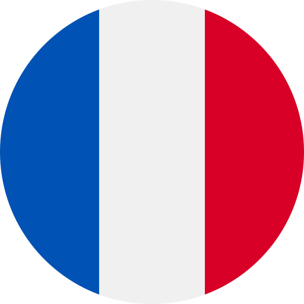
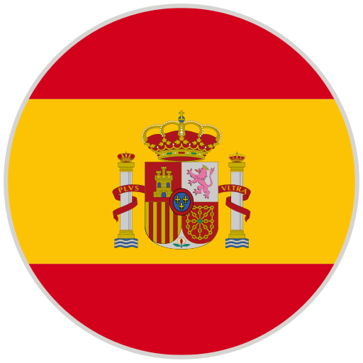

<a href="/" style="color: black">**Home**</a> <a style="color: green"> • </a> <a href="/about" style="color: black">**About**</a> <a style="color: green"> • </a> <a href="/works" style="color: green">**Works**</a> <a style="color: green"> • </a> <a href="/listen" style="color: black">**Listen**</a> <a style="color: green"> • </a> <a href="/writings" style="color: black">**Writings**</a>

***

## Large ensemble and orchestra

  (a) test test test test test test test test test test test test test test test test test test test test test test test test test test test test test test (1)(a),  test test test test test test test test test test test test test test test test test test test test test test test test test test test test test test test test test test test test:

#### <a style="color: green"> Stray </a>

&nbsp; &nbsp; &nbsp; 20 MUSICIANS <a style="color: green"> • </a> 23' <a style="color: green"> • </a> 2022  
&nbsp; &nbsp; &nbsp; Premiere: **l'Orchestre des lauréats du Conservatoire** (CNSMDP), Jean Deroyer <a style="color: green"> • </a> Paris 

#### <a style="color: green"> And to think that night would not exist </a>

&nbsp; &nbsp; &nbsp; ORCHESTRA <a style="color: green"> • </a> 15' <a style="color: green"> • </a> 2019   
&nbsp; &nbsp; &nbsp; Premiere: **NEC Philharmonia**, David Loebel <a style="color: green"> • </a> Boston 

***

## Ensemble

#### <a style="color: green"> Thread </a>

&nbsp; &nbsp; &nbsp; FLUTE, CLARINET, PIANO, VIOLIN, VIOLA, and VIOLONCELLO <a style="color: green"> • </a> 15' <a style="color: green"> • </a> 2025   
&nbsp; &nbsp; &nbsp; Premiere: **Ensemble Linea**, Jean-Philippe Wurtz <a style="color: green"> • </a>  *Festival aux Chandelles* in Sainte-Marie-aux-Mines  <a style="color: green"> • </a> Commissioned by the Royaumont Foundation with the support of Christine Jolivet Erlih

#### <a style="color: green"> Split </a>

&nbsp; &nbsp; &nbsp; FLUTE, CLARINET, PIANO, VIOLIN, VIOLA, and VIOLONCELLO <a style="color: green"> • </a> 12' <a style="color: green"> • </a> 2023    
&nbsp; &nbsp; &nbsp; Premiere: **Ensemble l’Itinéraire**, David Milnes <a style="color: green"> • </a> Berkeley 

#### <a style="color: green"> Mesh </a>

&nbsp; &nbsp; &nbsp; FLUTE, OBOE, BASS CLARINET, TROMBONE, VIOLIN, VIOLA, and VIOLONCELLO <a style="color: green"> • </a> 10' <a style="color: green"> • </a> 2023  
&nbsp; &nbsp; &nbsp; Premiere: **Ensemble Court-circuit**, Jean Deroyer. <a style="color: green"> • </a> *Voix Nouvelles* at the Royaumont Abbey in Asnières-sur-Oise 

#### <a style="color: green"> Spirals, Orbits, and Circular Paths </a>

&nbsp; &nbsp; &nbsp; CONTRABASS CLARINET, 2 PERCUSSIONISTS, HARP, PIANO, ACCORDION, 2 VIOLINS, 2 VIOLAS, VIOLONCELLO, and DOUBLE BASS <a style="color: green"> • </a> 10' <a style="color: green"> • </a> 2021  
&nbsp; &nbsp; &nbsp; Premiere: **Ensemble intercontemporain**, Léo Margue, <a style="color: green"> • </a> Paris 

#### <a style="color: green"> Scaling </a>

&nbsp; &nbsp; &nbsp; FLUTE, BASS CLARINET, ALTO SAXOPHONE, FRENCH HORN, TROMBONE, PERCUSSION, 2 VIOLINS, VIOLA, VIOLONCELLO, and DOUBLE BASS <a style="color: green"> • </a> 13' <a style="color: green"> • </a> 2020    
&nbsp; &nbsp; &nbsp; Premiere: **Ensemble intercontemporain**, Léo Margue, <a style="color: green"> • </a> Paris 

#### <a style="color: green"> Ebb/Flow </a>

&nbsp; &nbsp; &nbsp; 8 TROMBONES, PERCUSSION, and 4 DOUBLE BASSES <a style="color: green"> • </a> 24' <a style="color: green"> • </a> 2020

#### <a style="color: green"> Flux </a>

&nbsp; &nbsp; &nbsp; FLUTE, CLARINET, PERCUSSION, PIANO, VIOLIN, VIOLONCELLO, DOUBLE BASS, and BARITONE SOLO <a style="color: green"> • </a> 23' <a style="color: green"> • </a> 2019-2020  
&nbsp; &nbsp; &nbsp; Premiere: **Alinéa, Tyler Bouque** (soloist), and Tristan Rais-Sherman (conductor) <a style="color: green"> • </a> Boston 

***

## Chamber

#### <a style="color: green"> Fits and Starts </a>

&nbsp; &nbsp; &nbsp; STRING QUARTET <a style="color: green"> • </a> 10' <a style="color: green"> • </a> 2024  
&nbsp; &nbsp; &nbsp; Premiere: **Del Sol Quartet** <a style="color: green"> • </a> Berkeley 

#### <a style="color: green"> Quartet </a>

&nbsp; &nbsp; &nbsp; CLARINET, VIOLIN, VIOLA, and DOUBLE BASS <a style="color: green"> • </a> 8' <a style="color: green"> • </a> 2019   
&nbsp; &nbsp; &nbsp; Premiere: **Callithumpian Consort** <a style="color: green"> • </a> Boston 

#### <a style="color: green"> Piano Trio </a>

&nbsp; &nbsp; &nbsp; VIOLIN, VIOLONCELLO, and PIANO <a style="color: green"> • </a> 10' <a style="color: green"> • </a> 2019  
&nbsp; &nbsp; &nbsp; Premiere: **Brouwer Trio** <a style="color: green"> • </a> *VIPA Festival* in Valencia 

#### <a style="color: green"> Duo </a>

&nbsp; &nbsp; &nbsp; FLUTE and VIOLONCELLO <a style="color: green"> • </a> 15' <a style="color: green"> • </a> 2019  
&nbsp; &nbsp; &nbsp; Premiere: members of **Ensemble Linea** <a style="color: green"> • </a> *Etchings Festival* in Auvillar 

***

## Solo

#### <a style="color: green"> Tessellate </a>

&nbsp; &nbsp; &nbsp; ALTO SAXOPHONE <a style="color: green"> • </a> 11' <a style="color: green"> • </a> 2021  
&nbsp; &nbsp; &nbsp; Premiere: **Iñaki Bermudez** <a style="color: green"> • </a> Paris 

#### <a style="color: green"> Prelude </a>

&nbsp; &nbsp; &nbsp; PIANO <a style="color: green"> • </a> 4' <a style="color: green"> • </a> 2019  
&nbsp; &nbsp; &nbsp; Premiere: **David Yu** <a style="color: green"> • </a> Boston 

***

## Solo with electronics

#### <a style="color: green"> Blur </a>

&nbsp; &nbsp; &nbsp; CONTRABASS CLARINET and ELECTRONICS <a style="color: green"> • </a> 8' <a style="color: green"> • </a> 2024   
&nbsp; &nbsp; &nbsp; Premiere: **Alain Billard** <a style="color: green"> • </a> *ManiFeste festival* at Ircam in Paris 

#### <a style="color: green"> A ritual, maybe </a>

&nbsp; &nbsp; &nbsp; DOUBLE BASS and ELECTRONICS <a style="color: green"> • </a> 8' <a style="color: green"> • </a> 2023   
&nbsp; &nbsp; &nbsp; Premiere: **Richard Worn** <a style="color: green"> • </a> Berkeley 

#### <a style="color: green"> Tessellated </a>

&nbsp; &nbsp; &nbsp; ALTO SAXOPHONE and ELECTRONICS <a style="color: green"> • </a> 14' <a style="color: green"> • </a> 2022     
&nbsp; &nbsp; &nbsp; Premiere: **Iñaki Bermudez** <a style="color: green"> • </a> Paris 

***

## Coming soon

#### <a style="color: green"> New Work </a>

&nbsp; &nbsp; &nbsp; ACCORDION <a style="color: green"> • </a> 7' <a style="color: green"> • </a> 2025  
&nbsp; &nbsp; &nbsp; For **Théo Ould**

#### <a style="color: green"> New Work </a>

&nbsp; &nbsp; &nbsp; MODERN HARPSICHORD <a style="color: green"> • </a> 5' <a style="color: green"> • </a> 2026   
&nbsp; &nbsp; &nbsp; For **Ninon Hannecart-Ségal**

***

<a href="/" style="color: black">**Home**</a> <a style="color: green"> • </a> <a href="/about" style="color: black">**About**</a> <a style="color: green"> • </a> <a href="/works" style="color: green">**Works**</a> <a style="color: green"> • </a> <a href="/listen" style="color: black">**Listen**</a> <a style="color: green"> • </a> <a href="/writings" style="color: black">**Writings**</a>

***

        

***

