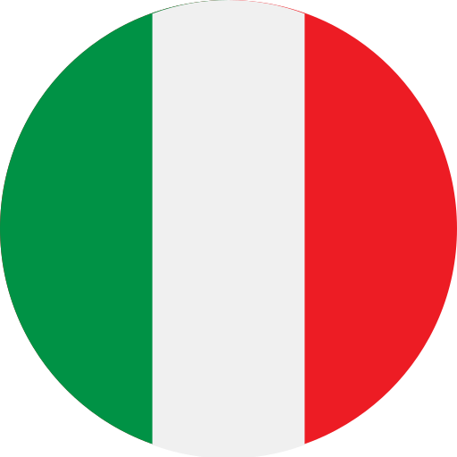
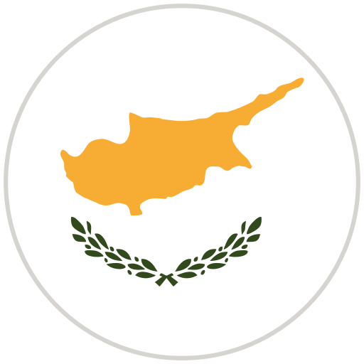

<a href="/" style="color: black">**Home**</a> <a style="color: green"> ▪ </a> <a href="/about" style="color: black">**About**</a> <a style="color: green"> ▪ </a> <a href="/works" style="color: green">**Works**</a> <a style="color: green"> ▪ </a> <a href="/listen" style="color: black">**Listen**</a> <a style="color: green"> ▪ </a> <a href="/writings" style="color: black">**Writings**</a>

***

<a style="color: green"><strong>Chronological</strong></a>

 
<strong>Coming Soon</strong>
 

<a style="color: green"> <strong>Rock Paper Scissors</strong> </a>

&nbsp; &nbsp; Flute, violin, and piano <a style="color: green"> ▪ </a> 6'

&nbsp; &nbsp; To be premiered in June 2026 <a style="color: green"> ▪ </a> Bled 

<strong>2026</strong>
 

<a style="color: green"> <strong>I've Heard That Song Before</strong> </a>

Soprano <a style="color: green"> ▪ </a> 8'
 
Premiered May 20th, 2026 by <strong>Maria Eleonora Caminada</strong> <a style="color: green"> ▪ </a> Milan 

<a style="color: green"> <strong>Scuffle</strong> </a>

Bass clarinet, drumset, and double bass <a style="color: green"> ▪ </a> 8'
 
Premiered March 14th, 2026 by the <strong>Patsioura Ensemble</strong> <a style="color: green"> ▪ </a> <strong>Reaching the Limits Festival</strong> <a style="color: green"> ▪ </a> Larnaca  <a style="color: green"> ▪ </a> <em>Commissioned by the Reaching the Limits Festival and CultureTones</em>

<strong>2025</strong>

<a style="color: green"> <strong>Zagzig</strong> </a>

Details for "Zagzig"

<a style="color: green"> <strong>Bloom</strong> </a>

Details for "Bloom"

<a style="color: green"> <strong>Thread</strong> </a>

Details for "Thread"

<strong>2024</strong>
 

<a style="color: green"> <strong>Blur</strong> </a>

Details for "Blur"

<a style="color: green"> <strong>Fits and Starts</strong> </a>

Details for "Fits and Starts"

<strong>2023</strong>
 

<a style="color: green"> <strong>Split</strong> </a>

Details for "Split"

<a style="color: green"> <strong>Mesh</strong> </a>

Details for "Mesh"

<a style="color: green"> <strong>A ritual, maybe</strong> </a>

Details for "A ritual, maybe"

<strong>2022</strong>
 

<a style="color: green"> <strong>Stray</strong> </a>

Details for "Stray"

<a style="color: green"> <strong>Tessellated</strong> </a>

Details for "Tessellated"

<strong>2021</strong>
 

<a style="color: green"> <strong>Spirals, Orbits, and Circular Paths</strong> </a>

Details for "Spirals, Orbits, and Circular Paths"

<a style="color: green"> <strong>Tessellate</strong> </a>

Details for "Tessellate"

<strong>2020</strong>
 

<a style="color: green"> <strong>Scaling</strong> </a>

Details for "Scaling"

<a style="color: green"> <strong>Ebb/Flow</strong> </a>

Details for "Ebb/Flow"

<a style="color: green"> <strong>Flux</strong> </a>

Details for "Flux"

<strong>2019</strong>
 

<a style="color: green"> <strong>Quartet</strong> </a>

Details for "Quartet"

<a style="color: green"> <strong>Piano Trio</strong> </a>

Details for "Piano Trio"

<a style="color: green"> <strong>Duo</strong> </a>

Details for "Duo"

<a style="color: green"> <strong>And to think that night would not exist</strong> </a>

Details for "And to think that night would not exist"

 

<a style="color: green"><strong>By Instrumentation</strong></a>

 
<strong>Coming Soon</strong>
 

